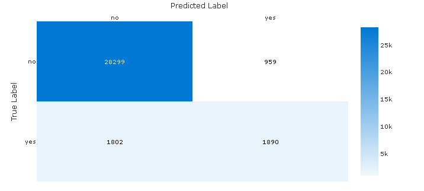
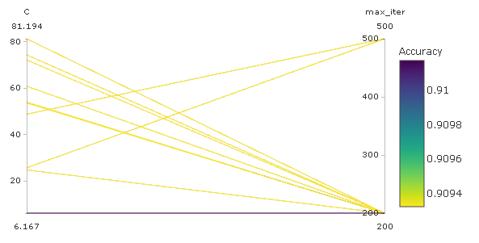
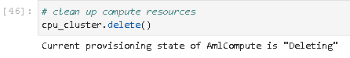

# Optimizing an ML Pipeline in Azure

## Overview
This project is part of the Udacity Azure ML Nanodegree.
In this project, we build and optimize an Azure ML pipeline using the Python SDK and a provided Scikit-learn model.
This model is then compared to an Azure AutoML run.

Some parts were set as the part of the task (e.g. choice of the accuracy metric in the custom model or data preparation step) and are assumed to be fixed.

## Summary

The dataset contains data about marketing campaign for bank customers, including socio-economical characteristics of the customers (e.g. marital, employment and education status) and campaign information (e.g. time, campaign identifier). The absence of the definitions for the variables does not allow evaluating their relevance to the problem and exclude possible data leakage. The target variable is not explicitly named (*y*), likely, it is the presence or absence of the response to a campaign. 

There are two classes of the target variable, and they are highly imbalanced. The majority class constitutes 88.8% and a naive model (no model) of predicting *no* would result in 88.8% accuracy. One can guess that the category of interest is actually *yes*, which means we might be interested in the power of a model to predict the minority class.

A voting ensemble of models created during the AutoML process showed the best performance in terms of accuracy. However, the difference in terms of accuracy is small for both approaches - custom model with hyperparameter tuning and AutoML. To achieve more relevant to the business outcomes, measures to counteract class imbalance, use of an alternative performance metrics and feature engineering are recommended.

## Scikit-learn Pipeline

The training data is cleaned and transformed to make it suitable for training. Some categorical variables are one-hot encoded (e.g. education), others transformed to binary variables (e.g. *yes* corresponding to 1 and *no* to 0) and numeric values (e.g. days of the week). 

The custom model is a logistic regression with two hyperparameters that are tuned using HyperDrive:

- Inverse of regularization strength
- Maximum number of iterations to converge

The random search of the parameter space was chosen for its relative computational efficiency (in comparison to the Bayesian sampling) and the ability to explore the parameter space with both continuous and discrete parameters. The random sampling is compatible with the early stopping policy that has a potential of lowering computation time and costs. The performance metric is evaluated every time the script reports the metric and the Bandit policy is configured to terminate any training runs that are below the calculated value with the slack factor of 0.15 (see details in [the documentation](https://docs.microsoft.com/en-us/python/api/azureml-train-core/azureml.train.hyperdrive.banditpolicy?view=azure-ml-py)). A number of runs was configured to 12.

The best model achieved the accuracy of 91.02%. The hyperparameter values of this model: the inverse of regularization strength of 6.167 and the maximum number of iterations to converge of 200. 

## AutoML

To make the results comparable to the custom logistic regression, accuracy maximization was chosen as the primary metric. The AutoML detected the class imbalance issue and warned that the results might give a false impression of higher accuracy.

A voting ensemble achieved the highest accuracy of 91.62%. There were multiple estimators in the ensemble, but the fact that it was an ensemble concealed individual hyperparameters. 

The confusion matrix of the winning model demonstrates that it is weak at predicting the minority class accurately. If this is class of interest than the model performance is poor despite relatively high overall accuracy. The true positive rate (recall) is only 0.51 which is practivally a random guess.

## Pipeline comparison

Both approaches - logistic regression with hyperparameter tuning and AutoML - achieved similar results in terms of accuracy (the difference of about half of a percent). However, the choice of this performance metric maybe be irrelevant to the banking marketing department. 

By speed and ease of use, the AutoML approach is winning and by analyzing the various metrics one can quickly realize possible flaws in the formulation of the problem.

## Future work

First, a clear business problem formulation may influence the choice of the performance metric. Second, one can consider feature engineering to better reflect the business issue at hand. 

The training on the highly unbalanced dataset is likely to bias the accuracy results upwards. Both modelling approaches only gained a couple of percents of accuracy in comparison to the naive model (no model). Measures to counteract the unbalanced training dataset are recommended for future experiments.

If looking at the possible local improvements, the best custom model's inverse of regularization strength was the smallest among randomly sampled in the parameter space. Possible improvement steps include cupping the search space with a smaller value from the top to explore smaller values of this hyperparameter or increasing the number of runs.

## Proof of cluster clean up
Image of cluster marked for deletion:

